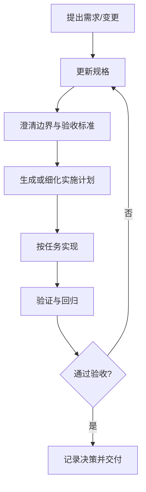

# SPEC-KIT 使用指南（仅使用）

## 1. 目标与原则

Spec Kit 的核心是 **Spec-Driven Development**：

- 先定义规格（要做什么、边界在哪、如何验收）
- 再拆计划（分阶段、分任务）
- 最后实现（按任务落地并回写结果）

一句话：**规格先行，计划驱动，实现跟随。**

---

## 2. 初始化后的使用主线

假设项目已完成 `specify init`，后续日常可按这条主线推进：



---

## 3. 日常命令速查（使用向）

- 查看命令帮助：`specify --help`
- 初始化新项目：`specify init <project-name>`
- 在当前目录初始化：`specify init . --ai <agent>`
- 当前目录简写初始化：`specify init --here --ai <agent>`
- 检查当前项目状态：`specify check`

> 说明：不同版本支持的参数可能略有差异，建议先 `specify --help` 再执行。

---

## 4. 典型使用场景

## 场景 A：新功能开发

1. 把需求写成规格（输入、输出、异常、验收）。
2. 用规格拆出实现计划与任务顺序。
3. 按任务实现，完成后对照验收条目逐项验证。

建议关注点：

- 明确“功能完成”的可验证标准
- 把非目标写进边界（out-of-scope）
- 每个任务只对应一个清晰结果

## 场景 B：需求变更

1. 先改规格，而不是直接改代码。
2. 对比旧规格与新规格，标出受影响任务。
3. 更新计划后再进入实现。

建议关注点：

- 变更影响面（接口、数据、测试）
- 是否需要新增验收标准
- 旧任务是否应废弃或重排

## 场景 C：多人/多 Agent 协作

1. 用规格作为统一事实来源。
2. 按计划拆分任务边界，避免并行冲突。
3. 合并前按同一验收清单复核。

建议关注点：

- 任务边界是否可独立交付
- 决策是否被及时记录
- 回归是否覆盖跨模块影响

---

## 5. 写规格的最小模板（实用）

每个功能规格至少包含：

- **目标**：为什么做、解决什么问题
- **范围**：包含什么，不包含什么
- **输入/输出**：接口、字段、约束
- **行为规则**：正常流 + 异常流
- **验收标准**：可测试、可证明

你可以直接按下面结构写：

```markdown
## 功能目标

## 范围
- In scope:
- Out of scope:

## 输入与输出

## 规则与边界

## 验收标准
- [ ] ...
- [ ] ...
```

---

## 6. 计划拆分建议（避免“规格很清楚但难落地”）

任务拆分建议遵循：

- 单任务可在短周期完成并验证
- 每个任务有明确产出物（代码、测试、文档）
- 任务之间依赖关系清晰（先后顺序明确）

可参考的任务粒度：

1. 数据结构/接口定义
2. 核心业务流程
3. 异常与边界处理
4. 测试与回归验证
5. 文档与发布说明

---

## 7. 验收与闭环（最关键）

完成实现后不要直接宣布完成，先做闭环：

1. 对照规格的验收清单逐项打勾
2. 记录与原规格不一致处（若有）
3. 必要时回写规格并同步计划

闭环检查清单：

- 需求是否全部覆盖
- 边界条件是否验证
- 变更是否有记录
- 后续风险是否可见

---

## 8. 常见误用（仅使用层面）

- 只用 `specify init`，后续不维护规格
- 需求改了但只改代码不改规格
- 计划任务过大，导致“看似在做但难验收”
- 没有验收清单，最后只能主观判断完成

---

## 9. 一句话记忆

**先写清楚，再做正确，最后可验证。**

