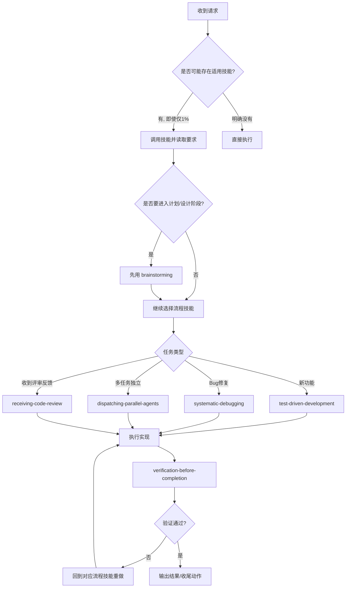

# Superpowers 使用指南（详细版）

## 1. 先理解 Superpowers 在做什么

Superpowers 不是“某一个命令”，而是一套「先选工作方法，再执行任务」的技能体系。  
它解决的核心问题是：避免直接上手写代码导致返工、漏测、误判完成。

一句话：**先选技能（HOW），再做用户要求的事（WHAT）。**

---

## 2. 最高优先级规则（必须记住）

1. 用户指令优先级最高（包括项目规则文件和用户口头要求）。
2. 在不冲突时，Superpowers 技能优先于默认行为。
3. 只要有 1% 可能适用某技能，就先调用该技能确认。
4. 不要“先干一点再说”，技能检查必须先于探索、提问、改代码。

常见误区（请直接规避）：

- “这只是个小问题，不用技能” -> 错，问题也是任务。
- “我先看下代码再决定” -> 错，先技能再探索。
- “我记得这个技能内容” -> 错，技能会迭代，需按当前版本执行。

---

## 3. 命令怎么调用（按平台）

### Claude Code

- `Skill <skill-name>`

### Copilot CLI

- `skill <skill-name>`

### Gemini CLI

- `activate_skill <skill-name>`

建议把下面这三条当默认模板：

```bash
Skill using-superpowers
Skill brainstorming
Skill verification-before-completion
```

---

## 4. 技能选择策略（先流程，后实现）

Superpowers 推荐两层选择：

1) **流程技能（Process）**：决定方法论，先用  
2) **实现技能（Implementation）**：决定执行细节，后用

### 4.1 典型流程技能

- `using-superpowers`：所有会话入口，先定规则
- `brainstorming`：做功能前澄清目标/约束/验收
- `systematic-debugging`：修 bug 前建立证据链
- `test-driven-development`：实现前先定义测试
- `verification-before-completion`：完成前必须验证

### 4.2 典型实现/协作技能

- `dispatching-parallel-agents`：任务可并行时拆分执行
- `subagent-driven-development`：按计划分工到子代理
- `requesting-code-review`：阶段完成后请求评审
- `receiving-code-review`：处理评审意见前先做严谨核验
- `finishing-a-development-branch`：收尾与分支整合决策

---

## 5. 标准执行流程（详细）



---

## 6. 场景化命令模板（可直接照抄）

## 场景 A：新功能开发（推荐）

```bash
Skill using-superpowers
Skill brainstorming
Skill test-driven-development
# 实施开发
Skill verification-before-completion
Skill requesting-code-review
```

## 场景 B：修复线上 bug（推荐）

```bash
Skill using-superpowers
Skill systematic-debugging
Skill test-driven-development
# 修复并补测试
Skill verification-before-completion
```

## 场景 C：需求大、可拆分并行

```bash
Skill using-superpowers
Skill brainstorming
Skill dispatching-parallel-agents
# 子任务并行完成
Skill verification-before-completion
```

## 场景 D：准备合并分支

```bash
Skill verification-before-completion
Skill finishing-a-development-branch
```

---

## 7. 执行检查清单（每次任务都可过一遍）

开始前：

- 是否调用了 `using-superpowers`
- 是否完成技能匹配（至少评估过流程技能）
- 是否明确成功标准（可测、可验证）

执行中：

- 是否按技能要求顺序执行（流程 -> 实现）
- 是否在偏离时回到对应流程技能纠偏
- 是否记录关键决策与假设

结束前：

- 是否调用 `verification-before-completion`
- 是否有可复现的验证证据（测试/命令/结果）
- 是否在输出中明确限制与后续动作

---

## 8. 与 GSD 的关系（如何配合）

可以这样理解：

- **GSD**：项目管理与阶段推进框架（从 roadmap 到 execute）
- **Superpowers**：每一步具体“怎么做”的方法守门员

推荐组合：

1. 用 GSD 选阶段：`/gsd-plan-phase`、`/gsd-execute-phase`
2. 每个阶段内部，用 Superpowers 约束方法：
   - 功能开发 -> `brainstorming` + `test-driven-development`
   - 问题修复 -> `systematic-debugging`
   - 收尾验收 -> `verification-before-completion`

---

## 9. 日常速查（精简）

- 默认开局：`using-superpowers`
- 做功能前：`brainstorming`
- 写实现前：`test-driven-development`
- 修 bug 前：`systematic-debugging`
- 多任务可并行：`dispatching-parallel-agents`
- 结束前必做：`verification-before-completion`

---

## 10. 一句话记忆

**先技能再行动，先流程后实现，先验证再完成。**

