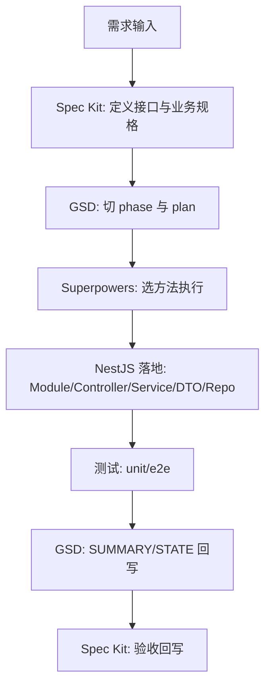

# 三者协同处理示例模板（NestJS 专用）

## 1. 适用范围

用于 NestJS 项目中，协同使用：

- `Spec Kit`：定义 API/业务规格与验收
- `GSD`：管理 phase/plan/执行与状态
- `Superpowers`：约束具体开发方法（TDD/调试/验证）

---

## 2. NestJS 项目协同总流程



---

## 3. 可复制任务卡（NestJS 字段）

```markdown
## 任务名
<例：新增 /profiles/avatar 上传接口>

## 一、Spec Kit（规格）
### 1) 目标
- 

### 2) API 契约
- Method/Path:
- Auth:
- Request DTO:
- Response DTO:
- Status Code:

### 3) 业务规则
- 

### 4) 错误与边界
- 参数非法:
- 资源不存在:
- 权限不足:
- 幂等/重复提交:

### 5) 验收标准
- [ ] 正常流通过
- [ ] 异常流返回符合约定
- [ ] Swagger/文档更新
- [ ] unit/e2e 通过

## 二、GSD（推进）
### 1) Phase
- Phase:
- Depends on:

### 2) Plan 拆解
- Task 1: 定义 DTO + validation
- Task 2: Controller 路由与参数绑定
- Task 3: Service 业务逻辑
- Task 4: 数据访问层（Prisma/Repository）
- Task 5: unit/e2e + 文档

### 3) Wave
- Wave 1: 契约与骨架
- Wave 2: 逻辑实现
- Wave 3: 测试与收尾

### 4) 产物
- PLAN:
- SUMMARY:
- STATE:

## 三、Superpowers（方法）
### 1) 方法链
- 功能开发：brainstorming -> test-driven-development
- Bug 修复：systematic-debugging
- 收尾：verification-before-completion

### 2) 证据要求
- 测试命令：
- 测试结果：
- 风险与限制：

## 四、实施映射（NestJS）
### 1) 文件变更
- module:
- controller:
- service:
- dto:
- prisma/repository:
- test(unit):
- test(e2e):

### 2) 回滚与兼容
- 是否破坏兼容:
- 是否需要 feature flag:

## 五、闭环
- GSD 回写：SUMMARY/STATE
- Spec 回写：验收结果与变更记录
- 交付决策：可发布 / 需补充
```

---

## 4. 场景模板 A：新增 REST API

### Spec Kit

- 定义 `Method + Path + DTO + Status`
- 明确鉴权策略（JWT/Role/Owner）
- 列出至少 3 条异常流验收

### GSD

- Phase N 新增计划：
  - `N-01` DTO 与接口契约
  - `N-02` Service + 数据访问
  - `N-03` 测试与文档

### Superpowers

- `brainstorming`：先对齐边界
- `test-driven-development`：先写测试再实现
- `verification-before-completion`：收尾验真

---

## 5. 场景模板 B：改数据模型（Prisma）

### Spec Kit

- 写清字段变更与兼容策略
- 明确迁移前后行为差异

### GSD

- 计划拆分：
  - schema 变更
  - migration
  - service 适配
  - 回归测试

### Superpowers

- 复杂改动先 `brainstorming`
- 有故障迹象用 `systematic-debugging`
- 结束前验证迁移与回归结果

---

## 6. 场景模板 C：线上 bug（接口 500）

### Spec Kit

- 固化问题规格：触发条件、影响范围、期望行为

### GSD

- 紧急插入 phase 或加急 plan
- 任务链：复现 -> 定位 -> 修复 -> 回归

### Superpowers

- 必用 `systematic-debugging`
- 修复后补防回归测试
- `verification-before-completion` 再宣布完成

---

## 7. NestJS 验收清单（通用）

- [ ] DTO 有 `class-validator` 约束
- [ ] Controller 只做编排，不承载复杂业务
- [ ] Service 逻辑可单测
- [ ] Repository/Prisma 调用有错误处理
- [ ] 单元测试覆盖核心分支
- [ ] e2e 覆盖关键接口与异常流
- [ ] 文档（Swagger/README）同步更新

---

## 8. 一句话记忆

**Spec Kit 管“定义正确”，GSD 管“推进到位”，Superpowers 管“执行靠谱”。**

