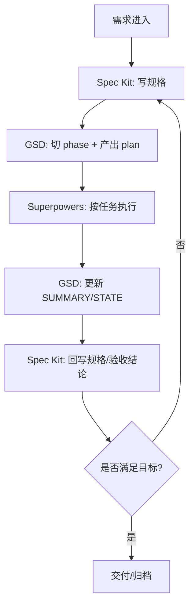

# Spec Kit + GSD + Superpowers 协同处理示例模板

## 1. 使用说明

本模板用于同一个项目中，让三者分工协同：

- `Spec Kit`：定义需求规格与验收标准（做对的事）
- `GSD`：编排阶段计划并推进执行（把事做完）
- `Superpowers`：约束具体执行方法（用对方法做）

建议顺序：**先 Spec，后 GSD，再 Superpowers 执行，最后双向回写**。

---

## 2. 一页式协同总流程



---

## 3. 协同任务卡模板（可复制）

```markdown
## 任务名
<例：用户资料接口增加头像上传>

## 一、Spec Kit（规格层）
### 1) 目标
- 

### 2) 范围
- In scope:
- Out of scope:

### 3) 输入/输出
- 输入：
- 输出：

### 4) 边界与异常
- 

### 5) 验收标准（可测试）
- [ ] 
- [ ] 

## 二、GSD（推进层）
### 1) Phase 映射
- Phase:
- Depends on:

### 2) Plan 拆解
- Task 1:
- Task 2:
- Task 3:

### 3) 执行顺序/波次
- Wave 1:
- Wave 2:

### 4) 完成产物
- PLAN:
- SUMMARY:
- STATE 更新:

## 三、Superpowers（方法层）
### 1) 方法选择
- 新功能：brainstorming -> test-driven-development
- Bug 修复：systematic-debugging
- 收尾：verification-before-completion

### 2) 执行要求
- 证据：
- 测试：
- 风险：

## 四、闭环
### 1) GSD 回写
- SUMMARY 结论：
- STATE 下一步：

### 2) Spec 回写
- 验收是否通过：
- 规格是否变更：

### 3) 交付决策
- [ ] 可发布
- [ ] 需补充
```

---

## 4. 场景模板 A：新增 API 功能

## 4.1 Spec Kit（先定义）

- 功能目标：`<新增什么接口，解决什么问题>`
- 请求与响应：`<DTO/字段/状态码>`
- 业务规则：`<鉴权、幂等、限制>`
- 验收标准：
  - [ ] 正常流程通过
  - [ ] 关键异常返回正确
  - [ ] 文档与测试已更新

## 4.2 GSD（再编排）

- 把需求放入目标阶段：`<Phase N>`
- 计划拆分：
  - Task1：定义 DTO/契约
  - Task2：实现 service/controller
  - Task3：测试与回归

## 4.3 Superpowers（执行方法）

- 先 `brainstorming` 明确边界
- 再 `test-driven-development` 先测后写
- 完成前 `verification-before-completion`

## 4.4 闭环回写

- GSD：更新 `SUMMARY/STATE`
- Spec：更新验收结论与变更记录

---

## 5. 场景模板 B：线上 Bug 修复

## 5.1 Spec Kit（问题规格化）

- 现象：`<用户看到的错误>`
- 影响范围：`<接口/模块/用户群>`
- 复现条件：`<前置条件 + 步骤>`
- 验收标准：
  - [ ] 可稳定复现旧问题
  - [ ] 修复后复现失败
  - [ ] 无关键回归

## 5.2 GSD（修复推进）

- 插入紧急阶段或补充当前阶段计划
- 最小任务链：
  - 定位
  - 修复
  - 回归

## 5.3 Superpowers（执行方法）

- 使用 `systematic-debugging`（证据 -> 假设 -> 验证）
- 修复后补测试（可结合 TDD）
- 收尾前 `verification-before-completion`

## 5.4 闭环回写

- GSD：记录修复摘要和风险
- Spec：记录根因、边界和防复发措施

---

## 6. 场景模板 C：需求变更（中途改需求）

## 6.1 Spec Kit（先改规格）

- 变更点：`<旧需求 -> 新需求>`
- 范围变化：`<新增/删除能力>`
- 验收变化：`<新增用例>`

## 6.2 GSD（再调计划）

- 标记受影响 phase / plan
- 重排任务依赖与优先级
- 必要时拆新 wave

## 6.3 Superpowers（执行方法）

- 先 `brainstorming` 对齐变更意图
- 再按复杂度选择 TDD / 并行执行
- 最后统一验证

## 6.4 闭环回写

- GSD：计划变更记录可追溯
- Spec：保留变更历史与验收结果

---

## 7. 协同边界清单（避免混用）

- 不用 GSD 代替规格定义（规格归 Spec Kit）
- 不用 Superpowers 代替项目排程（排程归 GSD）
- 不在未更新规格时直接改实现
- 不在无验证证据时宣称完成

---

## 8. 开工前 30 秒检查

- [ ] 规格是否清楚（目标/边界/验收）
- [ ] 是否有 phase/plan 承接
- [ ] 是否选了正确执行方法（功能/调试/验证）
- [ ] 是否定义了回写点（GSD 与 Spec）

---

## 9. 一句话总结

**Spec Kit 定义方向，GSD 驱动推进，Superpowers 保证动作质量。三者协同，项目才能稳、快、可验证。**

