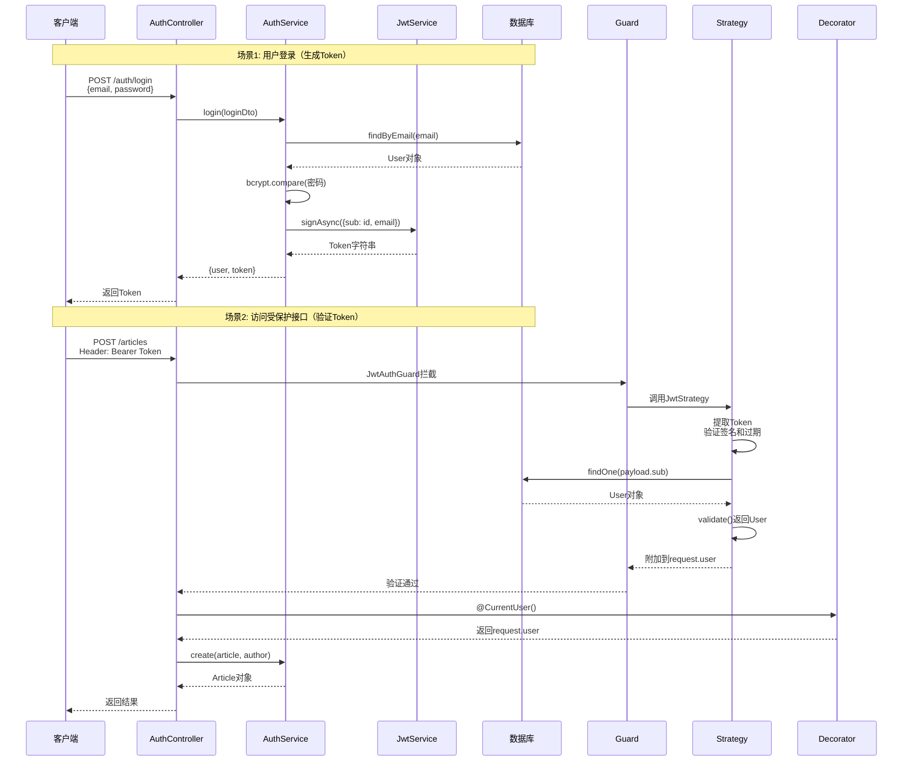

#### JWT完整流程

```mermaid
sequenceDiagram
    participant Client as 客户端
    participant Controller as AuthController
    participant Service as AuthService
    participant JWT as JwtService
    participant DB as 数据库

    Note over Client,DB: 场景1: 用户登录（生成Token）
    Client->>Controller: POST /auth/login<br/>{email, password}
    Controller->>Service: login(loginDto)
    Service->>DB: findByEmail(email)
    DB-->>Service: User对象
    Service->>Service: bcrypt.compare(密码)
    Service->>JWT: signAsync({sub: id, email})
    JWT-->>Service: Token字符串
    Service-->>Controller: {user, token}
    Controller-->>Client: 返回Token

    Note over Client,DB: 场景2: 访问受保护接口（验证Token）
    Client->>Controller: POST /articles<br/>Header: Bearer Token
    Controller->>Guard: JwtAuthGuard拦截
    Guard->>Strategy: 调用JwtStrategy
    Strategy->>Strategy: 提取Token<br/>验证签名和过期
    Strategy->>DB: findOne(payload.sub)
    DB-->>Strategy: User对象
    Strategy->>Strategy: validate()返回User
    Strategy-->>Guard: 附加到request.user
    Guard-->>Controller: 验证通过
    Controller->>Decorator: @CurrentUser()
    Decorator-->>Controller: 返回request.user
    Controller->>Service: create(article, author)
    Service-->>Controller: Article对象
    Controller-->>Client: 返回结果
```